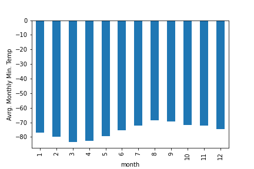
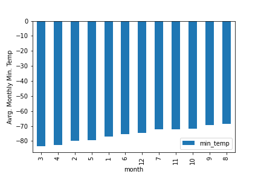
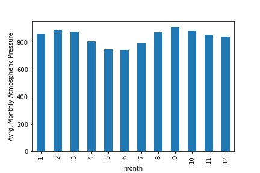
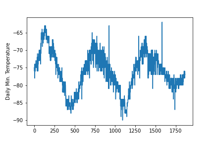

# web_scraping_challenge
## Part 1: Scrape Titles and Preview Text from Mars News
For this Part of the challenge, the following tasks were completed:
- Automated browsing was used to visit the Mars News site, and the HTML code was extracted using Beautiful Soup.
- The titles and preview text of the news articles were scraped and extracted.
- The scraped information was stored in the specified Python data structure (a list of dictionaries).

The following files were generated as part of this part of the challenge:

1 - Jupyter notebook with the code used: part_1_mars_news.ipynb.

2 - Data exported to a JSON file: mars.json

3 - Data exported to a MongoDB database: MongoDB_mars_collection.csv, and screenshot at MongoDB_mars_collection.png (see image below).\
 

Figure 1. Screenshot of MongoDB collection.
 

## Part 2: Scrape and Analyze Mars Weather Data
 
For this Part of the challenge, the following tasks were completed:

- The HTML table was extracted into a Pandas DataFrame. Splinter and Beautiful Soup were used to scrape the data. 
- The data was analyzed to answer all five listed questions (see below), with data visualizations provided when specified.
- The DataFrame was exported into a CSV file: mars_weather_data.csv.
Please see Jupyter notebook used at the part_2_mars_weather.ipynb file.

1 - How many months exist on Mars?

To answer this question, the highest number in the "months" column of the generated "weather_data_df" dataframe was extracted. Thus there are 12 months in Mars.

2 - How many Martian (and not Earth) days worth of data exist in the scraped dataset?

For this, the number of data points in the "weather_data_df" dataframe were extracted, since each datapoint corresponds to one day of data. There are 1867 days worth of data.

3 - What are the coldest and the warmest months on Mars (at the location of Curiosity)? To answer this question:
- Find the average the minimum daily temperature for all of the months.
- Plot the results as a bar chart.

Figure 2 shows the average monthly minumum temperatures, and Figure 3 shows the same data sorted from lowest to highest temperatures. The coldest and warmest months can be identified graphically, by looking at the two extreme temperatures in Figure 3, or using code, which can be seen in the jupyter notebook. 

In summary:\
Lowest temp was  -83.31 in month  3\
Highest temp was  -68.38 in month  8
 
 
\
Figure 2. Monthly average minimum temperatures.
 
 
\
Figure 3. Monthly average minimum temperatures sorted.
 
 
4 - Which months have the lowest and the highest atmospheric pressure on Mars? To answer this question:
- Find the average the daily atmospheric pressure of all the months.
- Plot the results as a bar chart.

The months with the highest and lowest atmospheric pressures were identified graphically, looking at the highest and lowest values in Figure 4, and their corresponding months. The lowest atmospheric pressure occured in Month 6, and the highest in Month 9.
 
 

Figure 4. Monthly average atmospheric pressure.
 
 
5 - About how many terrestrial (Earth) days exist in a Martian year? To answer this question:
- Consider how many days elapse on Earth in the time that Mars circles the Sun once.
- Visually estimate the result by plotting the daily minimum temperatu

To visually estimate the answer to this question, the numbers of martian days (horizontal axis in Fitgure 5) between two peaks of temperature were estimated, which occurred at approximately 750 and  100, thus there are about 650 terrestrial days in a Martian year.
 
 

Figure 5. Daily minimum temperature.

